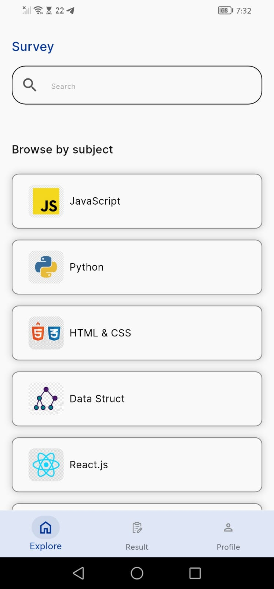
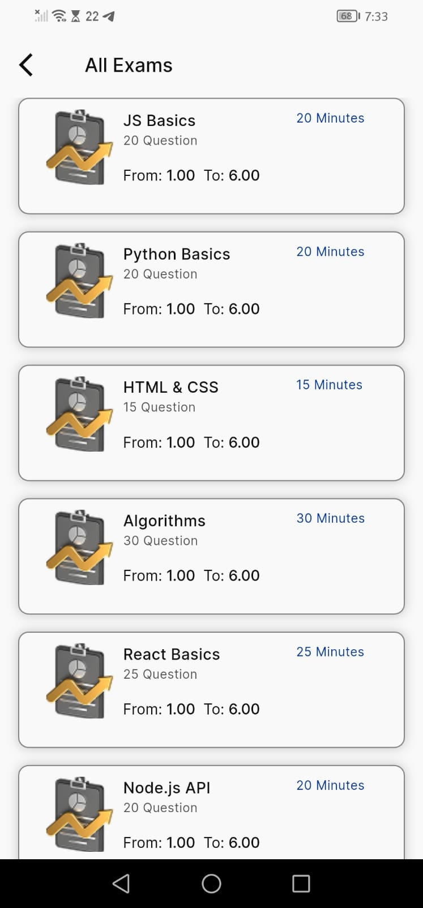
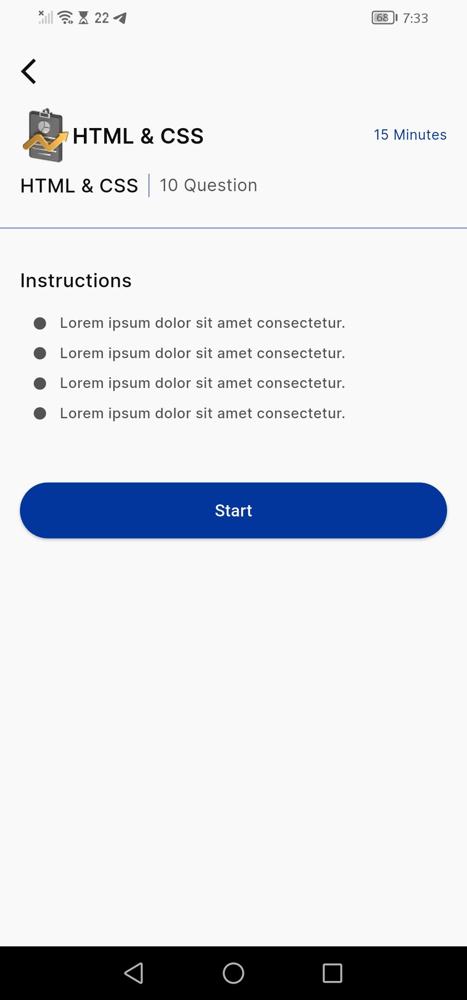
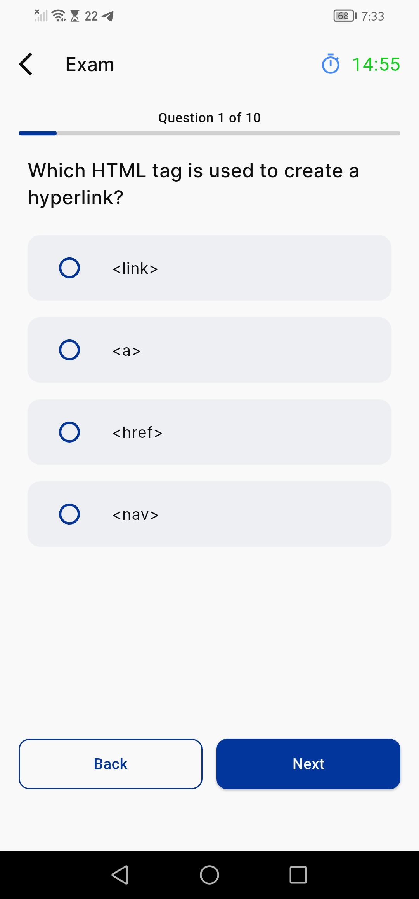
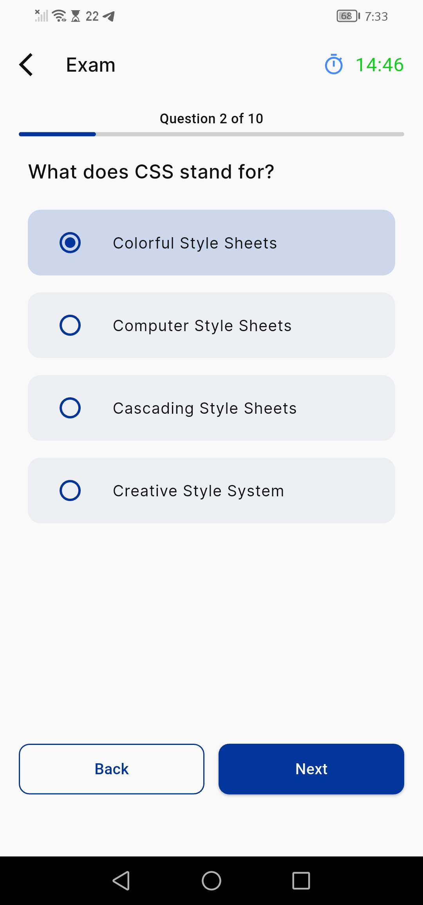
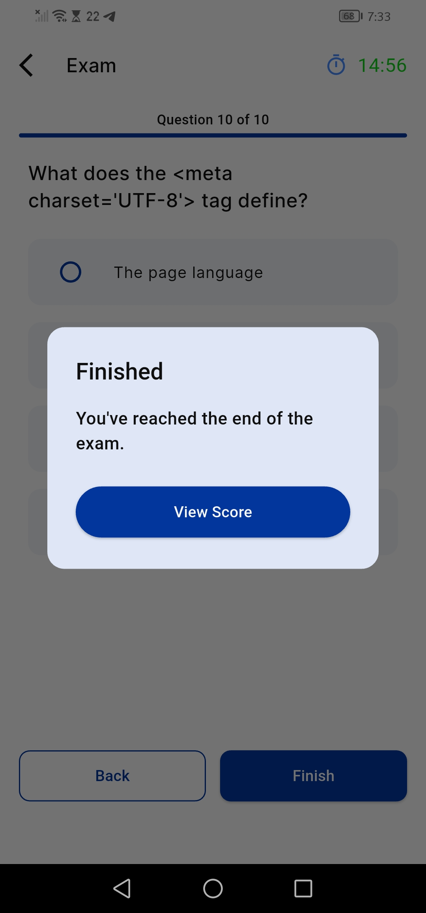
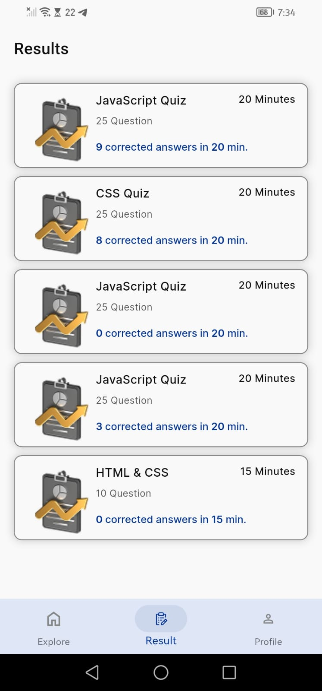
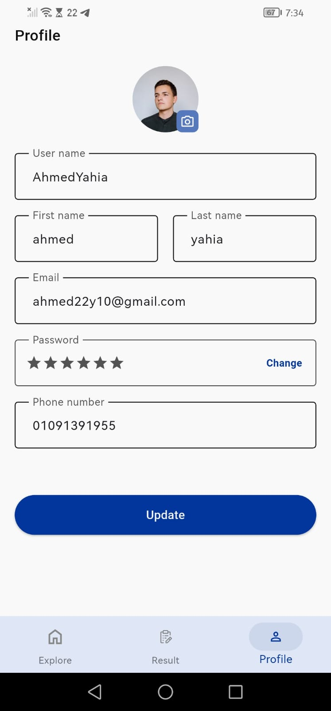

# Online Exam App

A Flutter mobile app for browsing, taking, and tracking timed multiple-choice exams across different programming and CS subjects (JavaScript, Python, HTML & CSS, Data Structures, React.js, Algorithms, Node.js, and more). Users can search for exams, take a timed quiz, review their answers afterward, and track their history and scores from a personal profile.

> Note: app name, tech stack, and a few other details below are placeholders — update the bracketed `[ ]` items with your project's actual choices.

## Features

- **Explore** — search bar and a "Browse by subject" list (JavaScript, Python, HTML & CSS, Data Structures, React.js, ...)
- **All Exams** — per-subject list of exams showing title, question count, time limit, and grading scale (e.g. From 1.00 To 6.00)
- **Exam details / instructions** — overview screen with rules and a Start button before the timer begins
- **Timed exam flow** — live countdown timer, "Question X of Y" progress bar, single-choice questions, Back / Next navigation
- **Finish flow** — confirmation dialog ("You've reached the end of the exam") before revealing the score
- **Results history** — list of completed attempts with subject, duration, question count, and number of correct answers
- **Answer review** — per-question breakdown highlighting the correct answer in green against the user's selection
- **Profile management** — view/update username, first & last name, email, password, phone number, and profile photo

## Screens

| Screen | Purpose |
|---|---|
| Explore | Search and browse exam subjects |
| All Exams | List of available exams for a chosen subject |
| Exam Details | Instructions, duration, and question count before starting |
| Exam (Question) | Multiple-choice question with timer and progress bar |
| Finish | End-of-exam confirmation dialog |
| Results | History of completed exams and scores |
| Answers | Correct vs. selected answer review |
| Profile | View and update account info |

## Tech Stack

- Flutter & Dart
- State management: `[Provider / GetX / Bloc / Riverpod]`
- Backend / data source: `[Firebase / REST API / local mock data]`
- Local storage (if any): `[Hive / SharedPreferences / SQLite]`

## Project Structure

```
lib/
├── screens/
│   ├── explore/
│   ├── all_exams/
│   ├── exam_details/
│   ├── exam_taking/
│   ├── finish/
│   ├── results/
│   ├── answers/
│   └── profile/
├── models/
├── services/
├── widgets/
└── main.dart
```

## Getting Started

### Prerequisites

- Flutter SDK installed
- Android Studio or VS Code with the Flutter & Dart plugins
- A connected device or emulator

### Installation

```bash
git clone [your-repo-url]
cd [project-folder]
flutter pub get
flutter run
```

## Screenshots

| Explore | All Exams | Exam Details |
|---|---|---|
|  |  |  |

| Question | Answering | Finish |
|---|---|---|
|  |  |  |

| Results | Answer Review | Profile |
|---|---|---|
|  |  |  |

## Roadmap / Possible Improvements

- [ ] Add categories beyond programming (general knowledge, languages, etc.)
- [ ] Add exam difficulty levels
- [ ] Add leaderboard / ranking among users
- [ ] Offline mode for taking exams without internet

## License

`[MIT / Apache 2.0 / proprietary — add your license here]`